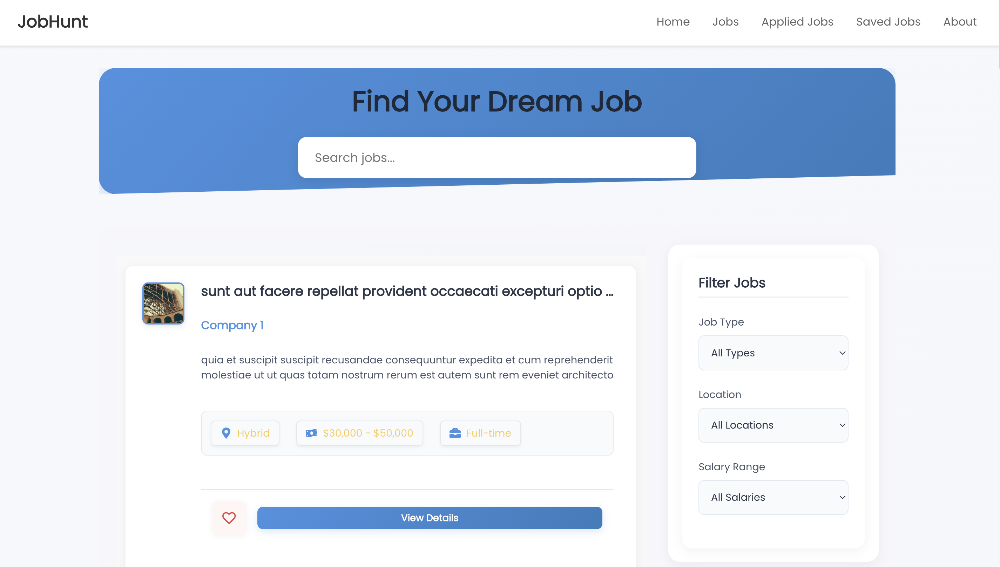
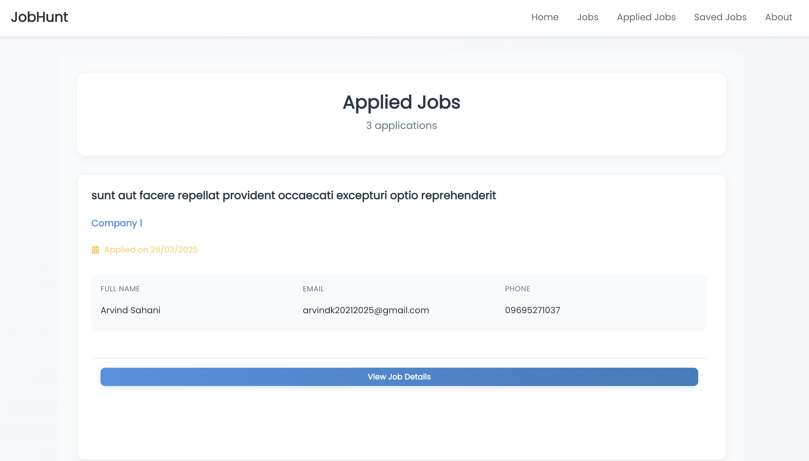
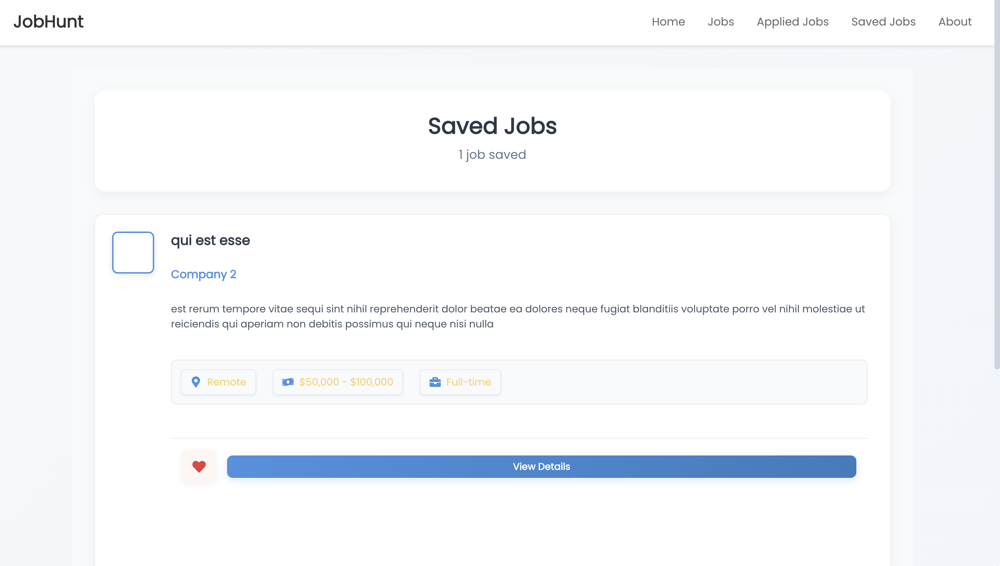
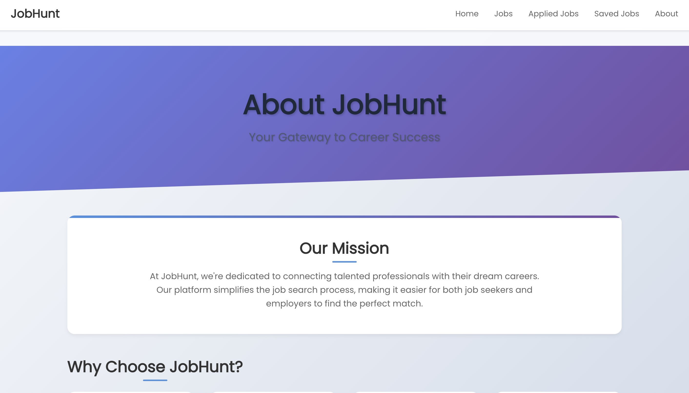

# JobHunt - Job Search and Application Platform

A modern job search platform built with React that allows users to browse job listings, save favorite jobs, and apply for positions.

---

## 🔥 Preview

Here are a few screenshots of the JobHunt platform in action:

<p float="left">
  
  
  
  
  
</p>

---

## 🚀 Features

### 🧭 Job Listings
- Display job cards with company information and job details
- Pagination with 10 jobs per page
- Search functionality to filter jobs
- Filter jobs by:
  - Job Type (Full-time, Part-time, Contract, Internship)
  - Location (Remote, On-site, Hybrid)
  - Salary Range

### 📄 Job Details
- Detailed view of each job posting
- Company information with logo
- Job description, requirements, and responsibilities
- Save job functionality
- Apply Now button with application status tracking
- Meta information display (Location, Salary, Job Type)

### ❤️ Saved Jobs
- Save favorite job listings
- View all saved jobs in a dedicated section
- Remove jobs from saved list
- Persistent storage using localStorage

### 📤 Job Application
- Apply for jobs through a dedicated form
- Track application status
- View all applied jobs
- Application history persistence

---

## 🛠 Tech Stack

### 🖥 Frontend
- React.js
- React Router for navigation
- Redux for state management
- CSS3 for styling
- React Icons for UI elements

### 🔗 APIs & Storage
- JSONPlaceholder API for job data
- localStorage for data persistence

### 🧰 Development Tools
- Create React App
- Git for version control
- npm/yarn for package management

---

## 🧪 Setup and Installation

### Navigate to the project directory:

```bash
cd JobHunt
```

### Install dependencies:

```bash
npm install
# or
yarn install
```

### Start the development server:

```bash
npm start
# or
yarn start
```

### Open in browser:
[http://localhost:3000](http://localhost:3000)

---

## 📁 Project Structure

```plaintext
jobhunt/
├── src/
│   ├── components/
│   │   ├── Jobs/
│   │   ├── JobDetails/
│   │   ├── SavedJobs/
│   │   └── AppliedJobs/
│   ├── redux/
│   ├── Assests/
│   │   ├── page1.png
│   │   ├── page2.png
│   │   ├── page3.png
│   │   ├── page4.png
│   │   └── page5.png
│   ├── App.js
│   └── index.js
├── public/
└── README.md
```

---

## 📌 Notes

- Ensure the image filenames and extensions match exactly (e.g., `page1.png`, not `page1.PNG`).
- All screenshot images should be added and committed to `src/Assests/` in the repository for them to display correctly on GitHub.

---

Just copy and paste this into your `README.md`, and you’re good to go. Let me know if you'd like to add a live demo, deployment instructions, or contributor info!
